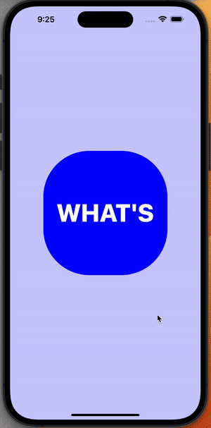

The React Native ScrollView interpolation example.

<h1 align="center">Interpolate ScrollView</h1>
 

</img>

Based on the excellent video tutorial: [Interpolate with ScrollView like a pro (React Native Reanimated 2)](https://www.youtube.com/watch?v=SqwpRr7kbnQ).

## Quick start

2. Clone the repo.
3. Change directory to the project with `cd interpolate-scrollview` command.
4. Run `yarn start` to start the Metro Bundler.
5. Press `i` to start the iOS simulator or `a` to run the Android emulator.📱

Happy hacking! 🤓

## Available commands

- `yarn start` - start Metro Bundler.
- `yarn ios` - run on iOS.
- `yarn android` - run on Android.
- `yarn web` - run on web.
- `yarn lint` - check code for errors.
- `yarn release` - generate a changelog, bump the version of app and create a new tag.
- `yarn test` - run tests.
